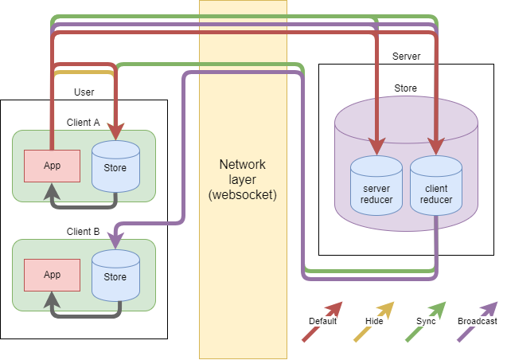

# redux-full-socket

An experimental client-server message-driven structure using redux and websockets.

The purpose of this project is to extends redux life cycle outside the client with websockets, by providing an API to its dispached actions.

Redux is used on both client and server in order to reuse client reducer. It has several benefits:
- CRUD tasks only needs to be implemented once
- The backend behaviour is entirely predictable: most server verifications may be avoided, resulting in an instant feedback for the client
- Actions can be broadcasted to every client that shares the same channel (e.g mobile & destop), which lets you maintain a cross-device synced state

The server-side store can include additionnal reducers for server-specific tasks.

The library consists of a server and 2 redux store enhancers: one for the client, one for the server.


## demos

[Counter](http://www.manufont.com/redux-full-socket/counter)

[Arena](http://www.manufont.com/redux-full-socket/arena)

[Snake](http://www.manufont.com/redux-full-socket/snake)

## actions API

By default, an action will be sent and dispatched to the server asynchronously, while dispatching it to the client store (short cycle). That way, the data is updated in real-time and the state is saved server-side.

You can control how an action travel through the cycle by extending it with these properties :

| Name | Type | Default | Description |
|:-----|:-----|:--------|:------------|
| sync | bool | false | If `true`, the action will be sent and dispatched synchronously to the server before being dispatched to the client (long cycle) |
| hide | bool | false | If `true`, the action will not be sent at all to the server. This may be useful for non-critical events |
| broadcast | bool | false | If `true`, the action will be dispatched to every client that shares the same credentials (short cycle for sender, long cycle for receivers) |



## progress

The project is at its very beginning.

For now, the server-side persistence is achieved by using [redux-persist](https://github.com/rt2zz/redux-persist) with a custom async storage using [node_redis](https://github.com/NodeRedis/node_redis).

The server-side state architecture needs to be improved.

Also, the project could benefit from socket.io Room & Namespace features.

## installation

Clone the repo, then launch the server

```
npm run server
```

Start another terminal and launch the client app

```
npm start
```

It'll open the demo app in browser, which is a counter with (ultra basic) user management.

## documentation

No documentation yet. Check out the methods exported by `/src/lib` and [redux-full-socket-server](https://github.com/manufont/redux-full-socket-server), and see how they're called in `server/` and `src/demos/`.
